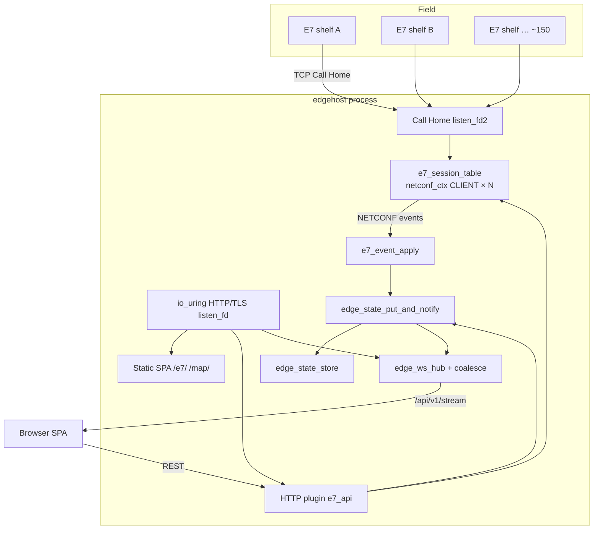
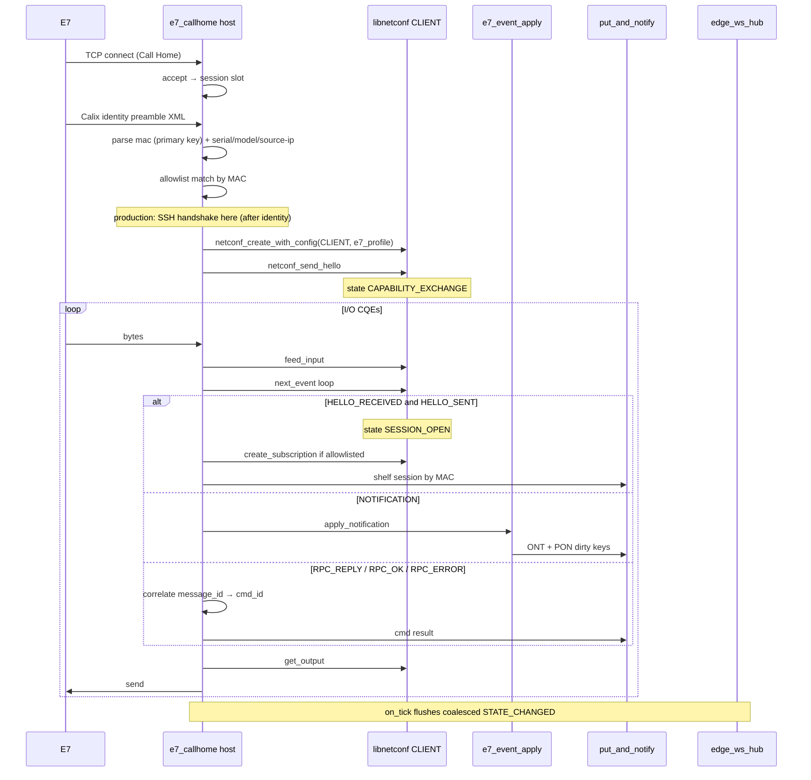

# Design: NETCONF Call Home for Calix E7 into edgehost

| Field | Value |
|-------|-------|
| **Document** | NETCONF Call Home — Calix E7 → edgehost |
| **Author** | Edge Platform (design revision 4) |
| **Date** | 2026-07-19 |
| **Status** | **Approved for implementation** (rev 4) — start PR-0/0a and PR-1 |
| **Primary repos** | `/home/dwhite/edgehost`, `/home/dwhite/libnetconf` |
| **Related** | `/home/dwhite/libwebmap`, `/home/dwhite/libipfix`, `/home/dwhite/librest`, `/home/dwhite/edge-platform-program-design.md` |

---

## Overview

Calix E7 OLT shelves will **Call Home** (RFC 8071) to edgehost: each E7 initiates a TCP connection to a dedicated Call Home listener. **Before SSH/NETCONF**, the shelf sends a Calix **identity preamble** XML; edgehost extracts the **MAC** as the primary shelf key. After identity (and SSH in production), edgehost acts as the **NETCONF client** (sends `<hello>`, RPCs, and `<create-subscription>`), while the E7 remains the NETCONF server. edgehost will maintain up to **~150 concurrent sessions**, stream NETCONF notifications into **`net.pon`** (ONT/PON) and **`inventory`** (keyed by MAC), and push live updates via WebSocket `STATE_CHANGED`.

The design **composes** sibling `libnetconf` for message framing (delimiter-based today), RPC helpers, and notification events — it does not reimplement XML parsing policy. Host I/O (listen/accept, identity preamble, per-session sockets, write drain) stays in the edgehost host layer, consistent with ADR-002 (core/host split) and the libnetconf plumbing model (ADR-006).

**Rev 4 (user decisions):** Primary shelf identity = **MAC from Calix pre-SSH identity string** (K17); production transport = **SSH Call Home** after lab raw (K7); `reload_policy: merge` confirmed (K15); design **approved for implementation** — first merges **PR-0 / PR-0a** and **PR-1**.

---

## Background & Motivation

### Current state

| Area | Reality today |
|------|----------------|
| **edgehost** | Multi-plugin io_uring webserver: SPA, state namespaces, WS fan-out, optional Postgres NOTIFY → state → WS, OpenAI HTTP plugin, Slack/Teams stubs. Track 1 through P1.16. |
| **State** | `net.core` + `map.dynamic` enabled; `net.pon`, `net.home`, `electric`, `inventory` registered but **disabled** until a producer exists. **Global** `max_keys_per_ns` with **eager** value buffers on every registered namespace (`src/core/state_store.c`). Defaults: 1024 keys × 4096 B × 6 ns ≈ **24 MiB**. |
| **Browser notify** | `GET /api/v1/stream` WebSocket; `STATE_CHANGED` JSON. Hub: `EDGE_WS_PENDING_MAX=8`, `EDGE_WS_MSG_MAX=4096+512`. REST/NOTIFY broadcast; **plugin `state_put` does not**. |
| **libnetconf** | Pure SM: `feed_input` / `next_event` / `get_output`. Roles: `NETCONF_ROLE_CLIENT` (NMS/outbound client) and `NETCONF_ROLE_CALLHOME_SERVER` (**library sense: NETCONF-server / accept-SSH-oriented peer** that emits `<session-id>` — dialectic tests use it as server). After session open, RPC **client helpers are role-agnostic**. Framing is **delimiter `]]>]]>`** (not full RFC 6241 §4.2 `#N` chunking). |
| **libassh in libnetconf** | **Placeholder** (`HAVE_LIBASSH` stubs; TODO Tier 2.1). Raw byte mode works without SSH. |
| **Output buffers** | `netconf_create_with_config` sizes output to `max_rpc_size` default **4 MiB** at create — 150 sessions × 4 MiB ≈ **600 MiB** if uncapped. |
| **Reply correlation** | Send helpers return message-id; `netconf_rpc_reply_t` has **no `message_id` field** — pending table is internal only. |
| **Calix telemetry domain** | libipfix PEN 6321 IEs for field naming (`ont-id`, shelf/slot/port, PON optical AIDs). Not NETCONF notification schema. |
| **Map** | `/map/` + `map.dynamic` feed; `ALLOWED_NS = ["map.dynamic"]`; `FIBER_CPE` class exists. |

### Pain points

1. No NAT-friendly durable management channel without outbound SSH to every shelf.
2. `net.pon` has no producer.
3. Ops need visual shelf/ONT status beyond `/lab/`.
4. In-process producers cannot reliably notify browsers until `state_put` fan-out is fixed.
5. Naïve “raise keys to 32k” is infeasible under current eager-global state allocator.

### Why Call Home

RFC 8071: **device initiates TCP**; after the connection is up, NETCONF application roles remain client (NMS) / server (device). Calix E7 additionally sends a **connection identity XML preamble** (MAC, serial, model, source-ip) **before** the SSH exchange — host must parse this and key the shelf by **MAC**. Lab uses **raw** NETCONF framing on port **4334**; production uses **SSH Call Home** (RFC 8071 + SSH) once libnetconf libassh is ready.

---

## Goals & Non-Goals

### Goals

1. **Call Home listener** on a configurable host/port, separate from the HTTP SPA port.
2. **Per-E7 NETCONF client sessions** via libnetconf (`NETCONF_ROLE_CLIENT` after host accept for raw mode).
3. **Scale** for ~150 concurrent E7 sessions with an **explicit RSS budget** (state + libnetconf + host buffers).
4. **Config + status UI** under the company SPA.
5. **Event streaming** into **ONT** + **PON** state under `net.pon` (lab synthetic extractors first; real Calix fixtures before production claims).
6. **Browser notify** via `STATE_CHANGED`, with **coalescing** under floods.
7. **Command placeholder** REST API with **message-id correlation**.
8. **Map extension points** for GPS/home outlines (phase 2).
9. Follow edgehost patterns: YAML + SIGHUP, static plugins, pins, C11, tests.

### Non-Goals (phase 1)

- Full Calix YANG surface / complete command catalog.
- YANG schema validation.
- IPFIX ingest (naming alignment only).
- Production-grade Call Home mutual auth beyond allowlist + future SSH host key (raw is lab-only).
- Multi-process session sharding.
- Claiming full NETCONF 1.1 chunked framing conformance (libnetconf is delimiter-based today).
- Durable multi-node allowlist (Postgres optional later).

---

## Proposed Design

### High-level architecture



### Role model (Call Home) — **Decision K13**

| Layer | E7 (device) | edgehost (NMS) |
|-------|-------------|----------------|
| TCP | Connects outbound | Listens / accepts (**host owns accept**) |
| Identity preamble | Sends Calix identity XML (pre-SSH) | Parses `<mac>` as primary key (K17) |
| SSH (production) | SSH client | SSH server (libassh; host or library path) |
| NETCONF app | NETCONF **server** | NETCONF **client** |

#### Lab: raw transport (phase 1)

After `accept()` and **identity preamble parse** (K17), create:

```c
netconf_ctx_t *nc = netconf_create_with_config(NETCONF_ROLE_CLIENT, &e7_nc_profile);
```

Rationale:

- NMS must send **client-shaped hello** (no `<session-id>`). `NETCONF_ROLE_CLIENT` already does that.
- `NETCONF_ROLE_CALLHOME_SERVER` is the **NETCONF server peer** in libnetconf/dialectic — not used for NMS raw sessions.
- Host owns TCP accept + identity preamble; library owns NETCONF SM only.

#### Production: SSH Call Home (confirmed)

After lab vertical works: **SSH Call Home** (RFC 8071 + SSH) on the same listen port path, once libnetconf **libassh** is ready (PR-8 / library milestone). Sequence: TCP accept → **identity preamble** → SSH handshake → NETCONF over SSH channel with `NETCONF_ROLE_CLIENT` SM (or fused CALLHOME SSH-server role for bytes only — NETCONF app remains client). Lab stays `transport: raw` on **4334**.

#### libnetconf APIs used

```c
/* NMS session after host accept */
netconf_ctx_t *netconf_create_with_config(NETCONF_ROLE_CLIENT, &e7_nc_profile);
size_t netconf_feed_input(ctx, data, len);
int    netconf_next_event(ctx, &event);   /* events: HELLO_*, RPC_*, NOTIFICATION, … */
size_t netconf_get_output(ctx, buf, max_len);
int    netconf_send_hello(ctx, caps, cap_count);
int    netconf_create_subscription(ctx, stream, filter);
int    netconf_get(ctx, filter);
int    netconf_send_rpc(ctx, xml_body, body_len); /* INNER op body, not outer <rpc> */
```

Session readiness is a **state**, not an event:

- `netconf_current_state(ctx) == NETCONF_STATE_SESSION_OPEN` after both hellos (`HELLO_SENT` + `HELLO_RECEIVED` events, `hello_sent && hello_received` inside library).

### Mandatory `netconf_config_t` profile (E7) — **Decision K14**

Every E7 session **must** use a reduced profile (never library defaults):

```c
/* Normative lab/prod-safe profile — wire in e7_callhome session create */
static void edge_e7_netconf_profile(netconf_config_t *c)
{
    memset(c, 0, sizeof(*c));
    c->event_queue_size      = 8;            /* MUST match Appendix A; drain every feed */
    c->max_rpc_size          = 256 * 1024;   /* also sizes output buffer today */
    c->max_notification_size = 64 * 1024;
    c->max_output_size       = 256 * 1024;   /* append backpressure */
    /* no store_to_postgres in phase 1 */
}
```

| Component | Per session | ×160 | Notes |
|-----------|-------------|------|-------|
| libnetconf output | 256 KiB | **40 MiB** | vs 600 MiB at 4 MiB default |
| libnetconf input start | 8 KiB (grows ≤ max_rpc) | ≤40 MiB worst | grow careful |
| Event queue × `sizeof(netconf_event_t)` | **8** × ~70 KiB ≈ 560 KiB | **~90 MiB** | dominated by `NETCONF_MAX_REPLY_LEN` 64 KiB in union; drain queue after every `feed_input` |
| Host rx/tx scratch | 64–128 KiB each | ~20–40 MiB | config `per_session_rx_cap` |

**Normative:** `event_queue_size = 8` everywhere (profile, RSS estimate, soak). Do not use 16 — that would ~double event RSS (~176 MiB) and leave almost no headroom under the default 256 MiB session budget once host buffers are included.

Optional **PR-0b**: shrink `netconf_event_t` reply payload for multi-session hosts if 90 MiB is still too high. Fail `edge_e7_callhome_create` if `max_sessions * estimated_bytes > e7_rss_budget_bytes` (config, default **256 MiB** for netconf+host session buffers excluding state).

### Module placement (edgehost)

| Component | Path | Kind |
|-----------|------|------|
| `edge_state_put_and_notify` | `include/edge_notify.h` or new `edge_state_notify.h`; impl next to `notify_apply` / `ws_stream` | Shared choke point |
| Call Home I/O + session table | `include/edge_e7_callhome.h`, `src/host/e7_callhome.c` | Host |
| Event → state apply | `include/edge_e7_event_apply.h`, `src/host/e7_event_apply.c` | Pure helpers |
| HTTP plugin | `include/edge_e7_api.h`, `src/plugins/e7_plugin.c` | `EDGE_PLUGIN_KIND_HTTP` |
| State capacity (store) | `include/edge_state.h`, `src/core/state_store.c` | Core (see below) |
| Config | `edge_config.h`, `config_yaml.c`, `edge_config.c` | YAML |
| SPA | `spa/e7/*`, home nav links | UI |
| Fixtures | `tests/fixtures/e7/*.xml` | Lab synthetic + later redacted samples |
| CMake / pins | `FindLibnetconf.cmake`, `deps/pins.txt` | |
| Guide / ADR | `docs/guides/e7-callhome.md`, `docs/decisions/018-e7-netconf-callhome.md` | |

### State capacity strategy — **Decision K10** (ADR-007 compliant)

**Problem:** `max_keys_per_ns` is **global**; each registered ns eagerly `calloc`s `capacity` value buffers of `max_value+1` (`src/core/state_store.c`). Raising to 32768 with 4 KiB values × 6 ns ≈ **768 MiB** reserved empty.

**ADR-007 constraint:** the state store uses **create-time allocation of fixed key slots** and **no post-create silent malloc**. ADR-003 similarly forbids silent post-create heap growth in edgecore machines. Therefore **put-path lazy `malloc` of value buffers is out of scope for phase 1** unless a future ADR explicitly amends ADR-007 (not planned here).

**Phase-1 strategy (required before any 150-session soak) — PR-2a:**

1. **Per-namespace capacity** (still **eager** value buffers for that ns, create/enable-time only):
   ```yaml
   state:
     max_keys_default: 1024
     max_value_bytes: 2048          # compact; helps EDGE_WS_MSG_MAX fit
     namespaces:
       net_pon:   { enabled: true,  max_keys: 16384 }
       inventory: { enabled: true,  max_keys: 512 }
       # net_core / map_dynamic stay at default 1024
   ```
   API sketch: `edge_state_ns_set_capacity(st, "net.pon", 16384)` before first put, or apply from YAML at store attach.
2. **Allocate entry tables only when a namespace is enabled** (enable-time / apply-config-time create — not put-time). Disabled namespaces: register name only or zero-capacity stub; **no** 16k empty tables for disabled `net.pon`.
3. **Compact values** — ONT JSON target **≤ 512–1024 B**; global/lab `max_value_bytes` **2048** (not 4096) so WS format can succeed (`EDGE_WS_MSG_MAX` ≈ 4608 envelope).
4. **No hierarchical single-blob-only** as primary model (hurts WS partial updates); optional rollup keys remain additive.
5. **RSS example (eager per-ns, enable-time only):**
   | Namespace | keys × value | Eager RSS |
   |-----------|--------------|-----------|
   | `net.pon` | 16384 × 2048 B | **~32 MiB** |
   | `inventory` | 512 × 2048 B | **~1 MiB** |
   | `net.core` + `map.dynamic` | 1024 × 2048 × 2 | **~4 MiB** |
   | disabled ns | no table / 0 | **~0** |
   | **Total state (e7 lab)** | | **~37 MiB** |
   | Forbidden alternative | 32768 × 4096 × 6 | **~768 MiB** |

`main.c` / io_uring attach: if `e7_enabled`, `edge_state_create_with_config` + per-ns caps + enable `net.pon`/`inventory` (not bare `edge_state_create()`).

**Explicit non-goal for PR-2a:** lazy value alloc on put/delete. If ever revisited, require amending ADR-007 with documented `EDGE_STATE_NOMEM` on OOM — not an undocumented exception.

### Integration with the io_uring loop — **Option A resolved**

**Decision:** Shared ring (Option A). Option B (nested ring) deferred unless profiling forces it.

#### `user_data` layout (extends existing `pack_ud`)

Today (`iouring_loop.c`):

```c
/* high 32 = op, low 32 = slot */
static uint64_t pack_ud(int op, int slot) {
    return ((uint64_t)(uint32_t)op << 32) | (uint32_t)slot;
}
```

**Extend to domain nibble in high bits of op word:**

```c
/* bit layout of user_data (64-bit):
 *  [63:56] domain  (uint8)  0 = HTTP, 1 = E7_CALLHOME, …
 *  [55:32] op      (24-bit) domain-local op
 *  [31:0]  slot    (uint32) domain-local slot / 0 for listen
 */
#define UD_DOMAIN_HTTP  0u
#define UD_DOMAIN_E7    1u

enum {
    /* HTTP domain — keep numeric values for HTTP ops stable */
    OP_ACCEPT = 1, OP_RECV = 2, OP_SEND = 3, OP_POLL = 4
};
enum {
    /* E7 domain ops */
    E7_OP_ACCEPT = 1,
    E7_OP_RECV   = 2,
    E7_OP_SEND   = 3,
    E7_OP_POLL   = 4
};

static uint64_t pack_ud3(uint8_t domain, uint32_t op, uint32_t slot) {
    return ((uint64_t)domain << 56) | ((uint64_t)(op & 0xffffffu) << 32) | slot;
}
```

Migration: existing HTTP paths use `pack_ud3(UD_DOMAIN_HTTP, op, slot)` (behavior-compatible if domain=0).

#### Second listen fd

```c
/* edge_iouring_opts_t addition */
typedef struct {
    /* … existing fields … */
    edge_e7_callhome_t *e7;  /* optional; not owned */
} edge_iouring_opts_t;
```

Lifecycle in `edge_iouring_run`:

1. Create HTTP `listen_fd` as today.
2. If `opts->e7` non-NULL and enabled: `edge_e7_callhome_bind()` → `e7_listen_fd`; `io_uring_prep_accept` with `pack_ud3(UD_DOMAIN_E7, E7_OP_ACCEPT, 0)`.
3. CQE loop: `unpack_ud3` → switch domain → HTTP handler or `edge_e7_callhome_on_cqe`.
4. Slot namespaces: HTTP `0 .. max_conns-1`; E7 `0 .. max_sessions-1` (never mixed).
5. On shutdown: cancel E7 accept, close sessions, close `e7_listen_fd`.

#### Tick / timeouts

Plugin `schedule_timer` remains stub. Use the **same pattern as pq_sidecar**: main loop wait timeout + monotonic clock.

- After each `io_uring_submit_and_wait` / peek batch, call `edge_e7_callhome_on_tick(e7, mono_ms)`.
- Tick handles: hello timeout, idle timeout, **WS coalesce flush**, command timeouts.
- No dependency on plugin timers for phase 1.

#### Sequence (states/events correct)



### Transport staging

| Mode | Config | Framing | Use |
|------|--------|---------|-----|
| `raw` | `transport: raw` | **libnetconf-compatible** `]]>]]>` delimiter (not full 1.1 chunking) | **Lab / fixtures / CI** on port **4334** |
| `ssh` | `transport: ssh` + host key | Identity preamble → **SSH Call Home** → NETCONF CLIENT SM | **Production** after libassh milestone (PR-8) |

Lab raw proves accept + **identity parse** + client SM + apply + SPA. Production is **SSH Call Home** (user decision). Track true NETCONF 1.1 `#N` chunking as libnetconf work if E7 requires it under SSH.

### Session table & identity — **Decision K17**

#### Calix Call Home identity preamble (pre-SSH; not NETCONF hello)

Prior to the SSH exchange, a Calix shelf sends an identity XML string. Example:

```xml
<version>1</version><identity><mac>00:02:5d:d9:21:47</mac><serial-number>071904926728</serial-number><model-name>E7 System</model-name><source-ip>192.168.35.13</source-ip></identity>
```

This is **Calix-specific Call Home identity framing**, not RFC 6241 `<hello>`.

| Field | Required | Use |
|-------|----------|-----|
| `identity/mac` | **Yes** | **Primary shelf key** — allowlist match, session table, state key path |
| `identity/serial-number` | Capture when present | Attribute on config/session JSON |
| `identity/model-name` | Capture when present | Attribute (e.g. `E7 System`) |
| `identity/source-ip` | Capture when present | Attribute; may differ from TCP peer |
| `version` | Capture when present | Framing version |

**Normalize MAC** to lowercase colon form: `00:02:5d:d9:21:47` (reject/invalid if unparseable).

**Host order of operations after accept:**

1. Read identity preamble (buffer until `</identity>` or size/timeout fail → close, `e7_rejects++`).
2. Parse `version` + `mac` (+ optional fields).
3. Match allowlist **by MAC** (primary). Optional secondary: `source_cidr` on config entry.
4. Lab raw: proceed to NETCONF CLIENT SM. Production: SSH then NETCONF.
5. State keys use MAC segment (see data model).

```c
#define EDGE_E7_MAX_SESSIONS     160
#define EDGE_E7_MAC_MAX          18   /* "aa:bb:cc:dd:ee:ff" + NUL */
#define EDGE_E7_SERIAL_MAX       32
#define EDGE_E7_MODEL_MAX        64
#define EDGE_E7_MAX_INFLIGHT_CMD 4

typedef enum {
    EDGE_E7_SESS_EMPTY = 0,
    EDGE_E7_SESS_ACCEPTED,
    EDGE_E7_SESS_IDENTITY,    /* reading/parsing Calix identity preamble */
    EDGE_E7_SESS_SSH,         /* production only */
    EDGE_E7_SESS_HELLO,       /* NETCONF hellos in progress */
    EDGE_E7_SESS_OPEN,        /* netconf_current_state == SESSION_OPEN */
    EDGE_E7_SESS_ERROR,
    EDGE_E7_SESS_CLOSING
} edge_e7_sess_state_t;

typedef struct {
    char mac[EDGE_E7_MAC_MAX];           /* primary key, normalized */
    char serial[EDGE_E7_SERIAL_MAX];
    char model[EDGE_E7_MODEL_MAX];
    char source_ip[EDGE_E7_PEER_ADDR_MAX];
    int  identity_ok;
} edge_e7_identity_t;
```

Session table stores `edge_e7_identity_t` plus peer TCP address. Allowlist entries are **keyed by MAC** (YAML/REST `mac` field required; optional `label` for humans).

### Event apply → ONT / PON state

#### Key canonicalization (fixed)

| Use | Form | Example |
|-----|------|---------|
| **Shelf key (MAC)** | lowercase colon MAC; for path segment use **hyphen** form | JSON `"mac":"00:02:5d:d9:21:47"`; key `e7/00-02-5d-d9-21-47/…` |
| **State ONT/PON segment** | slash → hyphen; lowercase | `e7/00-02-5d-d9-21-47/ont/1-1-3-12` |
| **JSON `ont_id` / `pon_id`** | Calix-style slash form preserved | `"ont_id":"1/1/3/12"` |
| Conversion | `edge_e7_mac_to_key_seg()`, `edge_e7_aid_to_key_seg()` | unit-tested |

#### Lab synthetic extractors (phase 1 honesty)

PR-3 ships **versioned extractor table** with **lab synthetic** XML only until field samples exist:

| Extractor id | Status | Input |
|--------------|--------|-------|
| `lab.v1` | **phase 1 default** | Fixtures under `tests/fixtures/e7/lab_v1_*.xml` |
| `calix.e7.tbd` | placeholder | Requires ≥2–3 redacted real/vendor-doc notifications before enabling in non-lab YAML |

**Lab v1 fixture contracts (normative for PR-3):**

1. `lab_v1_ont_up.xml` — notification with elements: optional `mac`/`shelf` ref, `ont-id` (`1/1/3/12`), `pon-id` (`1/1/3`), `oper-state`=`up`, `eventTime` (session already bound by connection MAC).
2. `lab_v1_ont_down.xml` — same ids, `oper-state`=`down`.
3. `lab_v1_pon_alarm.xml` — `pon-id`, `alarm`=`los`, `severity`.
4. `lab_v1_identity.xml` — Calix-shaped identity preamble for PR-4a peer/tests.

Namespaces in fixtures use a clear lab URI, e.g. `urn:edgehost:lab:e7:1.0`, **not** forged Calix URIs. Guide states: *“lab.v1 is not a Calix wire format.”*

When real samples arrive, add `calix.e7.<train>` extractor without breaking `lab.v1` tests.

#### State keys

| Namespace | Key pattern | Purpose |
|-----------|-------------|---------|
| `inventory` | `e7/{mac_key}/config` | Allowlist/config keyed by MAC segment (K15/K17) |
| `inventory` | `e7/{mac_key}/session` | Live session + identity attributes |
| `net.pon` | `e7/{mac_key}/shelf` | Health rollup |
| `net.pon` | `e7/{mac_key}/pon/{pon_key}` | PON state |
| `net.pon` | `e7/{mac_key}/ont/{ont_key}` | ONT state |
| `net.pon` | `e7/{mac_key}/events/last` | Bounded digest ring |
| `net.pon` | `e7/{mac_key}/cmd/{cmd_id}` | Command result |
| `map.dynamic` | `ont/{mac_key}/{ont_key}` | Phase 2 geometry |

`mac_key` = MAC with `:` → `-` (e.g. `00-02-5d-d9-21-47`). REST path `{id}` accepts either colon or hyphen MAC and normalizes.

Example ONT value (compact, &lt; 1 KiB):

```json
{
  "v": 1,
  "mac": "00:02:5d:d9:21:47",
  "serial": "071904926728",
  "ont_id": "1/1/3/12",
  "pon_id": "1/1/3",
  "status": "ok",
  "oper_state": "up",
  "updated_at": "2026-07-19T18:00:00Z",
  "source": "lab.v1"
}
```

### Browser notify — **Decision K16 (coalesce)**

#### Single choke point

```c
/* Preferred helper — ADR-018 */
edge_state_err_t edge_state_put_and_notify(
    edge_state_store_t *st,
    edge_ws_hub_t *hub,          /* NULL = put only */
    const char *ns, const char *key,
    const char *value, size_t value_len,
    const char *request_id,
    int coalesce);               /* 1 = dirty-bit path */
```

Used by: HTTP state PUT, `notify_apply`, Call Home apply, plugin host `api_state_put` (hub wired in PR-1). **Call Home does not also call hub directly** if it goes through this helper (avoids double-fire).

#### Phase-1 coalescing policy (committed)

1. On high-rate paths (`coalesce=1`): mark key dirty in a **fixed** dirty set; **do not** broadcast immediately.
2. `edge_e7_callhome_on_tick` / shared coalesce tick (≤100 ms): for each dirty entry, `state_get` + `edge_ws_hub_broadcast_state_changed`, clear dirty.
3. Low-rate paths (shelf connect/disconnect, command results): `coalesce=0` immediate broadcast.
4. If `edge_ws_format_state_changed` fails (`mlen < 0` because value too large): log + metric `ws_format_fail`; broadcast compact form `value: {"truncated":true,"status":…}` or `"value":null` (client refetches). **Phase 1 implements compact fallback**.
5. Metrics: `ws_drop_oldest`, `ws_format_fail`, `ws_coalesce_flush`, **`e7_coalesce_overflow`**.
6. Raise `EDGE_WS_PENDING_MAX` from 8 → **32** in same PR as coalesce (still bounded).

#### Dirty-set capacity (fixed; no unbounded growth)

| Parameter | Value |
|-----------|--------|
| `EDGE_E7_DIRTY_CAP` | **8192** fixed slots (create-time alloc in host module, not edgecore) |
| Slot contents | `(ns_id, key[EDGE_STATE_KEY_MAX])` or hashed key id + open-addressing |
| Insert hit | set dirty bit / mark used |
| **Overflow** (table full, new key) | **Do not grow.** Policy: (a) force **immediate** notify for that key (`coalesce=0` path), and (b) increment `e7_coalesce_overflow`. Optional escalation: if overflows exceed threshold in one tick, promote next marks to parent **PON** or **shelf** key only (collapse fan-out). |
| Hash collision | linear probe within table; if no free slot → same overflow policy |

Host-owned dirty table may use process malloc at Call Home create (host layer), consistent with hub/plugin_host patterns — not silent malloc inside `state_store.c`.

### Allowlist / shelf config SoT — **Decision K15**

**Phase 1:**

| Layer | Role |
|-------|------|
| **YAML `plugins.e7_callhome.shelves[]`** | Bootstrap seed; each entry requires **`mac`** (primary); optional `label`, `source_cidr`, `enabled` |
| **Runtime SoT** | State keys `inventory/e7/{mac_key}/config` JSON |
| **REST PUT/DELETE** | Mutates **runtime state only** (non-durable across restart); path id = MAC |
| **SIGHUP** | **`reload_policy: merge` (confirmed)**: re-seed YAML MACs (YAML wins for those MACs); runtime-only MACs **retained**. `replace_all` remains available but not the product default. |
| **Delete via REST** | Removes config key; if session open for that MAC → disconnect |
| **Accept policy** | `allow_all` (lab only) or `allowlist` by **MAC** after identity (see peer policy) |

#### Unknown / mismatched Call Home peer policy

| Stage | Condition | Action |
|-------|-----------|--------|
| 1. Post-accept | Optional early `source_cidr` deny (if configured and peer IP not in any CIDR) | **Close TCP**; `e7_rejects++`. |
| 1b | No early CIDR deny | Read **identity preamble**. |
| 2. Identity parse fail | Missing/invalid `<mac>` | Close; `e7_rejects++`. |
| 3. Identity OK, MAC **not** in allowlist, `accept_policy=allowlist` | Unknown shelf | Put `inventory/e7/{mac_key}/session` with `"status":"unconfigured"`, store identity attrs; **do not** subscribe unless `auto_subscribe_unknown: true` (default **false**). |
| 3b | `accept_policy=allow_all` | May proceed (lab); still record identity. |
| 4. Known MAC, `enabled: false` | Config present but disabled | Refuse subscribe; disconnect; status `disabled`. |
| 5. Known MAC, enabled | Allowlisted | After NETCONF `SESSION_OPEN` → subscribe if `auto_subscribe: true` (default true for configured shelves). |

Postgres `edge.e7_shelf` remains optional PR-10 for durability — not required for lab vertical.

UI must show banner: *“Allowlist changes are not written back to YAML; restart without state persistence loses REST-only shelves.”*

### Command placeholder API

```
POST /api/v1/e7/shelves/{mac}/commands
{
  "v": 1,
  "type": "raw_rpc",
  "rpc_xml": "<get><filter type=\"xpath\" select=\"/…\"/></get>",
  "timeout_ms": 15000
}
```

Path `{mac}` is the shelf MAC (colon or hyphen). **`rpc_xml` is the inner NETCONF operation body** passed to `netconf_send_rpc` (library wraps `<rpc message-id="…">`). Do **not** include outer `<rpc>`.

#### Correlation — **libnetconf change preferred**

**PR-0a (libnetconf):** add to `netconf_rpc_reply_t`:

```c
uint32_t message_id;  /* 0 if missing/unparsed */
```

Populate when parsing `<rpc-reply message-id="…">` (already extracted internally today for pending_rpc). Emit on `RPC_REPLY` / op-specific events.

**Interim (if PR-0a lags):** edgehost calls `netconf_xml_get_attr(reply.xml, …, "rpc-reply", "message-id", …)` from `netconf_rpc.h`.

Host table: `message_id → {cmd_id, shelf_slot, deadline_ms}` with **max 4 in-flight commands per shelf**. If `NETCONF_MAX_PENDING_RPCS` (32) would be exceeded, reject new command with 429.

Audit log line: `principal`, `mac`, `cmd_id`, `type`, `message_id`, result.

### Visual configuration UI

**`/e7/`** SPA (auth cookie ADR-013):

1. Shelves table — keyed by **MAC**; show serial/model/label/session status.
2. Shelf detail — ONT/PON tables via REST list + WS; **pagination** if keys &gt; `EDGE_STATE_LIST_CAP` (1000): prefix chunks or `GET /api/v1/e7/shelves/{mac}/onts?cursor=`.
3. Config form — allowlist by **MAC** (required), optional label/CIDR.
4. Command panel (placeholder) targeting MAC.

**Nav:** PR-6 adds links in `spa/index.html` / `home.js` app panel: “E7 Call Home” → `/e7/` next to map/lab.

**Auth:** `/api/v1/e7/*` classified like state write paths — require `employee` or `employee_admin` (commands require `employee_admin`). Mirror `edge_auth_classify` extensions for path prefix `/api/v1/e7`.

### Future map (phase 2)

Unchanged intent: when lon/lat present, mirror to `map.dynamic`; extend libwebmap feed; home outlines later.

### YAML configuration

```yaml
state:
  max_keys_default: 1024
  max_value_bytes: 2048
  namespaces:
    net_core:    { enabled: true }
    map_dynamic: { enabled: true }
    net_pon:     { enabled: true, max_keys: 16384 }  # when e7 on; eager table
    inventory:   { enabled: true, max_keys: 512 }

plugins:
  e7_callhome:
    enabled: false
    listen_host: 127.0.0.1      # lab: loopback; never 0.0.0.0+raw without allowlist
    listen_port: 4334
    max_sessions: 160
    rss_budget_bytes: 268435456 # 256 MiB session+netconf budget
    transport: raw              # raw | ssh
    host_key_path: ""
    accept_policy: allowlist    # allow_all only with lab banner
    # Required true if transport=raw AND listen_host is not loopback:
    lab_insecure_raw: false
    # SIGHUP: merge confirmed (YAML MAC wins for listed entries; runtime-only retained)
    reload_policy: merge
    hello_timeout_s: 30
    identity_timeout_s: 10        # max wait for Calix identity preamble
    idle_timeout_s: 0
    auto_subscribe: true          # configured enabled shelves (by MAC)
    auto_subscribe_unknown: false # never auto-sub unknown MAC in prod
    subscription_stream: NETCONF
    extractor: lab.v1
    coalesce_interval_ms: 100
    dirty_cap: 8192
    shelves:                      # bootstrap seed — keyed by MAC
      # - mac: "00:02:5d:d9:21:47"
      #   label: "west hut"
      #   enabled: true
      #   source_cidr: "192.168.35.0/24"
```

---

## API / Interface Changes

| Method | Path | Auth | Purpose |
|--------|------|------|---------|
| `GET` | `/api/v1/e7/status` | employee+ | Global Call Home metrics |
| `GET` | `/api/v1/e7/shelves` | employee+ | Config + live (by MAC) |
| `GET` | `/api/v1/e7/shelves/{mac}` | employee+ | Detail (identity attrs + session) |
| `PUT` | `/api/v1/e7/shelves/{mac}` | employee_admin | Runtime allowlist upsert (`mac` primary; optional label/cidr) |
| `DELETE` | `/api/v1/e7/shelves/{mac}` | employee_admin | Remove + disconnect |
| `POST` | `/api/v1/e7/shelves/{mac}/disconnect` | employee_admin | Force close |
| `POST` | `/api/v1/e7/shelves/{mac}/commands` | employee_admin | Placeholder command |
| `GET` | `/api/v1/e7/shelves/{mac}/commands/{cmd_id}` | employee+ | Poll result |
| `GET` | `/api/v1/e7/shelves/{mac}/onts` | employee+ | Paginated ONT list |

### Metrics (`/api/v1/e7/status`)

`e7_accepts`, `e7_sessions_open`, `e7_sessions_error`, `e7_notifications`, `e7_state_puts`, `e7_ws_fanouts`, `e7_ws_coalesce_flush`, `e7_ws_drop_oldest`, `e7_ws_format_fail`, `e7_coalesce_overflow`, `e7_commands_ok`, `e7_commands_err`, `e7_rejects`, `e7_unconfigured`, `e7_rss_estimate`.

---

## Data Model Changes

- Enable `net.pon` + `inventory` when Call Home enabled.
- **Per-ns capacity + enable-time eager tables + compact `max_value_bytes`** (PR-2a; ADR-007) before large key counts.
- Optional SQL history PR-10.

---

## Alternatives Considered

### 1. Outbound NETCONF client only

Rejected as primary (NAT). Future secondary mode possible.

### 2. External collector → REST/NOTIFY

Deferred for scale-out; keep key/REST contracts.

### 3. Pure SESSION plugin multi-accept

Rejected — fd ownership is host.

### 4. External sshd forced-command

Rejected for unified ops binary.

### 5. Host accept + `NETCONF_ROLE_CLIENT` (no CALLHOME_SERVER for raw) — **ADOPTED**

| Pros | Cons |
|------|------|
| Correct client hello; matches dialectic CLIENT tests; no fight with server session-id TODO | Name “Call Home” is only at TCP layer; SSH Call Home may later use library CALLHOME_SERVER for SSH server SM |

This is the phase-1 design (K13). Prefer over “strip session-id from CALLHOME_SERVER.”

---

## Security & Privacy Considerations

| Threat | Severity | Mitigation |
|--------|----------|------------|
| Spoofed ONT state | High | `allowlist` policy; SSH later; **never** ship example YAML with `0.0.0.0` + `raw` + `allow_all` without lab banner |
| Raw unauthenticated management plane | High | Hard-require: if `transport=raw` and `listen_host` not loopback, config validate warns/fails unless `lab_insecure_raw: true` explicit |
| Command injection | High | `employee_admin`; body cap; audit fields; in-flight cap |
| Accept flood | Medium | `max_sessions`; rejects metric |
| Oversized messages | Medium | e7 netconf profile caps |
| Stale ONT after disconnect | Medium | Mark shelf/ONTs disconnected + notify |
| Double WS events | Low | Single `put_and_notify` path |

---

## Observability

Status JSON, logs, state as telemetry, coalesce/drop metrics, command audit lines, soak under cgroup memory limits.

---

## Rollout Plan

| Stage | Gate |
|-------|------|
| 0 | libnetconf pin + CLIENT NMS dialectic + optional `message_id` on replies |
| 0b | State per-ns capacity + enable-time eager tables (ADR-007) |
| 1 | e7 disabled default; raw loopback |
| 2 | SPA + 1–2 lab fixtures |
| 3 | Soak 150 peers only after 0b + e7 profile RSS pass |
| 4 | **Production SSH Call Home** after libassh milestone (PR-8) |
| 5 | Production allowlist by MAC; `transport: ssh`; no raw on reachable interfaces |

**Implementation start (rev 4):** design approved — merge **PR-0 / PR-0a** and **PR-1** first.

Rollback: `enabled: false` + restart/HUP.

---

## Risks

| Risk | Severity | Mitigation |
|------|----------|------------|
| `netconf_event_t` ~70 KiB × queue × sessions | High | Small queue; optional libnetconf event shrink; RSS budget fail |
| Eager global keys if 2a slips | High | Block soak; do not “just set 32k” on global default |
| Put-path lazy state malloc | High | Forbidden in phase 1 (ADR-007); PR-2a is enable-time only |
| Unknown Calix notif XML | Medium | lab.v1 only until samples |
| WS pending depth | Medium | Coalesce + pending 32 |
| iouring_loop growth | Medium | E7 code in `e7_callhome.c`; loop only demux + tick |
| libassh size | High | Separate milestone; PR-8 gated |

---

## Open Questions

| # | Topic | Status |
|---|--------|--------|
| 1 | Production transport after lab raw | **Resolved (user):** SSH Call Home (RFC 8071 + SSH) once libassh ready; lab remains raw on 4334. |
| 2 | Canonical shelf identity | **Resolved (user):** MAC from Calix **identity preamble** (`<mac>`); capture serial/model/source-ip as attributes. Not configured-id + serial as primary. |
| 3 | SIGHUP `reload_policy` | **Resolved (user):** **`merge`**. |
| 4 | Real Calix notification samples for `calix.e7.*` extractors | **Open** — needs field eng; lab.v1 until then. |
| 5 | Shrink `netconf_event_t` before 150-session soak vs accept ~90 MiB queue RSS | **Open** — engineering choice at soak time (PR-0b optional). |

---

## Key Decisions

| # | Decision | Rationale |
|---|----------|-----------|
| K1 | Call Home primary (device initiates TCP) | NAT-friendly; user requirement |
| K2 | Compose libnetconf for SM/framing/RPC | No protocol reimplementation |
| K3 | Host module sessions + HTTP plugin REST | Multi-accept is host; REST fits plugin ABI |
| K4 | Separate Call Home listen fd + session table | HTTP `max_conns` default 64 insufficient |
| K5 | `net.pon` + `inventory` + WS notify | Existing state/SPA patterns |
| K6 | Single `edge_state_put_and_notify` choke point | Avoid dual paths / double fan-out |
| K7 | Transport: **lab raw** → **production SSH Call Home** (confirmed) | libassh incomplete for prod; lab unblocks vertical |
| K8 | Command placeholder via inner `rpc_xml` | Hook without full YANG |
| K9 | Map GPS phase 2 | Don’t block Call Home on GIS |
| **K10** | **Per-ns capacity + enable-time eager tables + compact values (no put-path malloc)** | ADR-007 create-time alloc; avoids 768 MiB global raise |
| K11 | Allowlist + RBAC; raw+open only with explicit lab flag | ADR-013 + thin auth honesty |
| K12 | Pin libnetconf in `deps/pins.txt` | Sibling pin policy |
| **K13** | **Raw Call Home: host accept + `NETCONF_ROLE_CLIENT`** | Correct client hello; CALLHOME_SERVER is server-oriented in library |
| **K14** | **Mandatory reduced `netconf_config_t` (`event_queue_size=8`) + RSS budget** | Defaults are 4 MiB output/session; queue 8 matches ~90 MiB event RSS |
| **K15** | **Allowlist by MAC; YAML bootstrap + runtime state; `reload_policy: merge` (confirmed)** | Clear SoT; peer unconfigured without auto-sub |
| **K16** | **WS dirty-set (cap 8192) coalesce ≤100 ms + overflow force-notify + compact fallback** | PENDING_MAX=8 and MSG_MAX vs ONT storms |
| **K17** | **Shelf primary key = MAC from Calix pre-SSH identity XML** | User decision; supersedes configured-id/serial as primary |

---

## References

| Resource | Path / note |
|----------|-------------|
| edgehost | `ARCHITECTURE.md`, `AGENTS.md`, `include/edge_*.h` |
| State store eager alloc | `src/core/state_store.c` register path |
| WS hub limits | `include/edge_ws.h` |
| io_uring pack_ud | `src/host/iouring_loop.c` |
| libnetconf API | `include/netconf.h`, `include/netconf_rpc.h` |
| libnetconf create output size | `src/netconf.c` `netconf_create_with_config` |
| libnetconf TODO SSH / session-id | `TODO.md` §2.1, §2.3 |
| Calix IPFIX | `libipfix/include/ipfix_enterprise_calix.h` |
| Map dynamic feed | `libwebmap/demo/display/dynamic_feed.js` |
| RFCs | 6241, 5277, 8071 |

---

## PR Plan

Each PR independently reviewable; ctest green; docs/pins as needed.

### PR-0 — libnetconf: NMS Call Home dialectic + docs (CLIENT after accept)

| | |
|--|--|
| **Title** | libnetconf: document Call Home NMS as CLIENT; add NMS dialectic test |
| **Files** | `docs/DOMAIN.md`, `ARCHITECTURE.md`, `tests/test_netconf_dialectic.c` |
| **Depends on** | — |
| **Description** | Clarify `CALLHOME_SERVER` = server-oriented role (session-id). Add test: CLIENT hello has no session-id; device-shaped peer hello includes session-id; subscription + notification. **No** “strip session-id from CALLHOME_SERVER” change that breaks server tests. |

### PR-0a — libnetconf: expose `message_id` on `netconf_rpc_reply_t`

| | |
|--|--|
| **Title** | libnetconf: rpc_reply.message_id for correlation |
| **Files** | `include/netconf.h`, `src/netconf.c`, tests |
| **Depends on** | — (parallel to PR-0) |
| **Description** | Populate message-id already parsed for pending_rpc onto public reply struct. |

### PR-0b (optional, before soak) — libnetconf: reduce event payload RSS

| | |
|--|--|
| **Title** | libnetconf: optional external/smaller reply buffers for multi-session hosts |
| **Files** | netconf event/queue internals |
| **Depends on** | — |
| **Description** | Only if 150-session RSS budget fails with queue_size=8. |

### PR-1 — edgehost: `edge_state_put_and_notify` + plugin hub wiring

| | |
|--|--|
| **Title** | edgehost: unified state put + STATE_CHANGED notify |
| **Files** | new helper, `plugin_host.c`, `edge_http1_serve.c`, `notify_apply.c`, hub opts, tests |
| **Depends on** | — |
| **Description** | Wire hub into plugin host; single helper; no double broadcast. Metrics for format fail. Optionally raise `EDGE_WS_PENDING_MAX` to 32. |

### PR-2 — edgehost: FindLibnetconf + e7 YAML skeleton (disabled)

| | |
|--|--|
| **Title** | edgehost: libnetconf pin + e7_callhome config fields |
| **Files** | `cmake/FindLibnetconf.cmake`, `deps/pins.txt`, `edge_config.*`, example YAML |
| **Depends on** | PR-0 pin SHA |
| **Description** | Config only; no listen. Fields include `lab_insecure_raw`, `reload_policy`, `auto_subscribe_unknown`, `dirty_cap`, `rss_budget_bytes`. Validate raw+non-loopback requires `lab_insecure_raw: true`. |

### PR-2a — edgehost: per-ns capacity + enable-time tables (ADR-007)

| | |
|--|--|
| **Title** | edgehost: per-namespace key caps; eager tables only when ns enabled |
| **Files** | `edge_state.h`, `state_store.c`, config YAML (`max_keys` per ns, `max_value_bytes`), tests, `state-namespaces.md`; note in ADR-007 “limits config” if needed (no lazy-put amendment) |
| **Depends on** | — (can parallel PR-2) |
| **Description** | Required before 150-session soak. **Remains ADR-007-compliant:** fixed slots allocated at ns enable/create, not on put. Compact default value size for e7 lab (2048). main uses `create_with_config` when e7 enabled. Explicitly does **not** introduce put-path malloc. |

### PR-3 — edgehost: e7_event_apply + lab.v1 fixtures

| | |
|--|--|
| **Title** | edgehost: lab.v1 ONT/PON apply parsers and fixtures |
| **Files** | `e7_event_apply.*`, `tests/fixtures/e7/lab_v1_*.xml`, `tests/test_e7_event_apply.c` |
| **Depends on** | PR-2a helpful for key volume tests |
| **Description** | Synthetic lab XML only; AID key canonicalization helpers; document “not Calix wire format.” |

### PR-4a — edgehost: Call Home listen + identity preamble + session table + raw CLIENT pump

| | |
|--|--|
| **Title** | edgehost: E7 Call Home accept, Calix identity parse (MAC), CLIENT I/O pump |
| **Files** | `e7_callhome.*` (incl. identity parser), `iouring_loop.c` demux (`pack_ud3`), `edge_iouring.h` opts, `main.c`, `tests/e7_raw_peer.c` + identity fixtures |
| **Depends on** | PR-0, PR-2, PR-2a (for enabled ns) |
| **Description** | Domain demux, second listen fd, session slots, **read/parse Calix identity preamble** (MAC primary; serial/model/source-ip attrs), allowlist match by MAC, e7 netconf profile, hello to `SESSION_OPEN`, metrics, disconnect. **No** full apply/WS product logic beyond session/inventory keys. Lab peer must emit identity XML then framed NETCONF. Unit tests for MAC normalize + preamble parse. |

### PR-4b — edgehost: subscribe + apply + coalesce notify

| | |
|--|--|
| **Title** | edgehost: E7 subscription, lab.v1 apply, coalesced WS |
| **Files** | `e7_callhome.c` (subscribe path), integrate PR-3 apply, coalesce tick, status metrics |
| **Depends on** | PR-1, PR-3, PR-4a |
| **Description** | create_subscription, notification → ONT/PON, put_and_notify coalesce, disconnect marks unknown. |

### PR-5 — edgehost: REST `/api/v1/e7/*` + commands

| | |
|--|--|
| **Title** | edgehost: E7 REST plugin and command placeholder |
| **Files** | `e7_plugin.c`, auth classify, tests |
| **Depends on** | PR-4a (sessions); PR-0a or XML attr for commands; PR-4b for richer status |
| **Description** | Shelves CRUD runtime SoT; commands with message_id correlation; RBAC; audit log. |

### PR-6 — SPA `/e7/`

| | |
|--|--|
| **Title** | spa: E7 admin UI |
| **Files** | `spa/e7/*`, `spa/index.html`, `home.js` nav, CSS |
| **Depends on** | PR-5 |
| **Description** | Tables, WS filter, command form, non-durability banner, ONT list pagination. |

### PR-7 — Docs / ADR / lab YAML

| | |
|--|--|
| **Title** | docs: E7 Call Home guide + ADR-018 |
| **Files** | guides, ADR, ARCHITECTURE, TODO, `config/edgehost.e7-lab.yaml` |
| **Depends on** | PR-4b–6 for accuracy; draft earlier OK |
| **Description** | Runbook, RSS budgets, lab.v1 honesty, security banners. |

### PR-8 — SSH Call Home (gated; production path)

| | |
|--|--|
| **Title** | Production SSH Call Home (identity → SSH → NETCONF CLIENT) |
| **Files** | libnetconf SSH implementation + tests; edgehost `transport: ssh`, host key config |
| **Depends on** | **libnetconf SSH milestone** (TODO §2.1), PR-4a (identity preamble must still run **before** SSH) |
| **Description** | User-confirmed production transport. Identity preamble remains pre-SSH. Not a single PR if libassh is large — edgehost enablement after library milestone. |

### PR-9 — Map phase 2 ONT points

| | |
|--|--|
| **Title** | map: ONT status overlays from map.dynamic |
| **Depends on** | PR-3–6 |
| **Description** | GPS mirror + libwebmap paint. |

### PR-10 (optional) — Postgres durability

| | |
|--|--|
| **Title** | sql: e7_shelf + notification history |
| **Depends on** | PR-5 |
| **Description** | Durable allowlist + history; live path remains state+WS. |

---

## Appendix A — Scale / memory budget (rev 3)

| Resource | Planning number |
|----------|-----------------|
| Sessions | 160 max |
| libnetconf output @ 256 KiB | ~40 MiB |
| Event queues @ **8** × ~70 KiB | **~90 MiB** (not 16; that would be ~176 MiB) |
| Host rx/tx | ~20–40 MiB |
| Dirty-set 8192 slots (host) | &lt; 2 MiB |
| State (eager): net.pon 16k×2KiB + inv 512×2KiB + defaults | **~37 MiB** |
| **Session+netconf budget default** | **256 MiB** hard fail if estimate exceeds |
| **Do not use** | 32k keys × 4 KiB × 6 ns (~768 MiB); put-path lazy malloc (ADR-007); `event_queue_size=16` without raising budget |

Soak: cgroup memory limit; N simulated raw peers; track RSS.

## Appendix B — Calix IPFIX naming alignment

Unchanged: PEN 6321 field names for JSON property names where useful. **Not** a notification schema.

## Appendix C — Lab raw peer

`tests/e7_raw_peer.c` (edgehost repo): connect, send **Calix-shaped identity preamble** (with `<mac>`), then delimiter-framed NETCONF hello with session-id, accept subscription, push `lab_v1_ont_up.xml`. Proves identity + host path — not production SSH.
